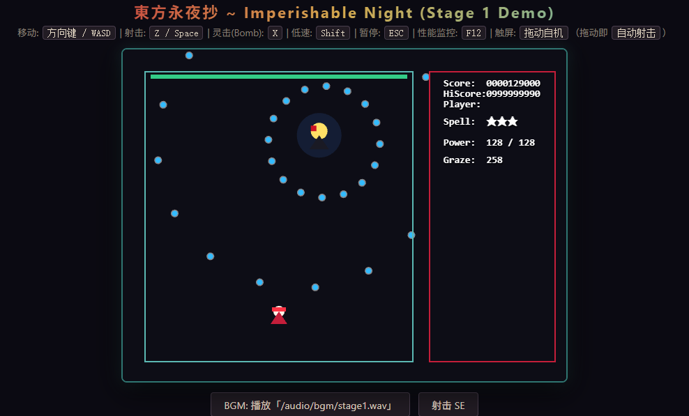
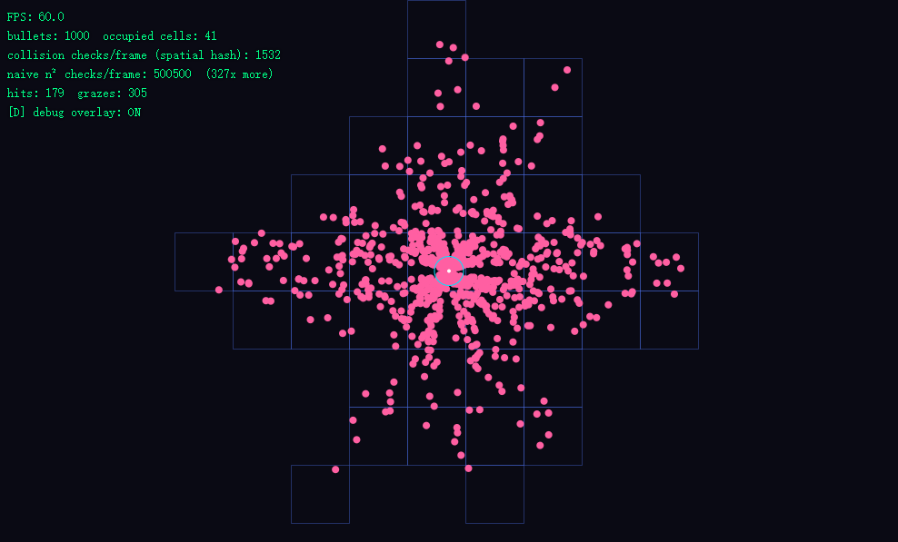

# @uestc-touhou/touhou-web-engine

> A high-performance, extensible STG (danmaku) game engine designed to recreate Touhou Project in the browser.

[](https://github.com/wray-lee/touhou-web-engine/actions/workflows/ci.yml)
[](https://opensource.org/licenses/MIT)
[](https://www.typescriptlang.org/)
[](https://pixijs.com/)

---

## 🌟 Highlights

- **Pure Web & Lightweight**: Built on TypeScript & PixiJS 8.x with WebGL hardware acceleration — 60 FPS guaranteed even with 2000+ bullets on screen.
- **Three-Tier Architecture**:
  1. **Engine Core** (`@core`): Pure game-agnostic STG engine (Entities, Spatial Hash Grid Collision, Timeline, Web Audio).
  2. **Touhou Common** (`@touhou`): Reusable abstractions for the Touhou series (Bullet Patterns, Player Controller, Boss/SpellCard mechanics, HUD).
  3. **Game Implementations** (`@/games/th08`): Game-specific stages, bosses, and spellcard scripts.
- **Battle-Tested Patterns**: Composite, Circular, Linear, Aiming bullet patterns with high-precision angle & angular velocity calculation.
- **Zero Heavy Audio Assets Required**: Built-in Web Audio API synthesis engine for retro arcade SE (shooting, graze, bombing, spellcards) **and BGM** (synthesized stage theme) — no asset files needed.
- **Object Pooled Bullets**: All bullet creation (player shots, enemy patterns, boss spellcards) routes through a shared object pool to minimize GC pressure.
- **Spatial Hash Collision**: Every collision (player bullets vs enemies/boss, player graze) resolves via 64px spatial hash neighbourhood queries — O(n²) loops eliminated.
- **Mobile Ready**: Touch-drag flies the ship and auto-fires; ESC pauses with a dedicated pause menu.
- **Gamepad + Rebindable Keys**: Standard-layout gamepads are polled automatically (D-pad/stick = move, A = shoot, B/X = bomb, LB/LT = focus, Start = pause); every binding can be remapped at runtime.

---

## 🕹️ Demo Pages

`bun run dev` 启动 Vite（默认 `http://localhost:3000`）后可访问：

| 路径 | 内容 |
|---|---|
| `/` | **主 Demo** —— TH08 全六面战役（角色/难度选择 + 时间系统 + 结算） |
| `/demo/input-test.html` | 输入映射可视化：8 个绑定芯片实时高亮 + 原始 `KeyboardEvent.code` + 拖动指针坐标 + 手柄状态（票据 05） |
| `/demo/renderer-test.html` | 渲染基准：100 个弹跳彩色圆圈 + 左上角 FPS 计数（票据 03） |
| `/demo/collision-test.html` | 碰撞基准：1000 弹 + 自机，`D` 键切换空间哈希网格/判定点调试浮层（票据 04） |
| `/example/index.html` | **库用法示例**：把引擎当 npm 包嵌入的最小装配（`new TH08Game()` → `init` → `start`，票据 15） |

---

## 🖼️ Screenshots

已补充可复现的 GUI 验证截图：






---

## 🎮 Playable Demo (TH08 Full Campaign)

The engine includes a complete playable six-stage **東方永夜抄 ~ Imperishable Night** campaign:
- Every wave, enemy movement, bullet pattern, laser and spell card comes from ZUN's own
  `ecldata*.ecl` scripts, translated offline into TypeScript coroutines. There is no hand-authored
  pattern left in the tree and no bytecode VM at runtime.
- Eight routes: stages 1-6 plus the 4A/4B and 6A/6B branches, each with its own mid-boss, boss,
  card sequence and `.std` 3D backdrop.
- All four difficulties are live branches of the same translated script (`difficultyMask`), so Lunatic
  is not a reskin of Normal.
- Fidelity is measured, not asserted: the four shipped retail demos (`demorpy0..3.rpy`) are replayed
  frame-for-frame through the simulation and scored against ZUN's own results.
- Player controls (four selectable teams, eight members):
  - Speeds come from the shipped `plyNNa.sht` tables, not from a shared constant: 5.0 / 4.0
    px/f unfocused and 2.2 / 2.3 / 2.0 / 1.9 focused per team, with every diagonal being its
    own axial speed over √2 (so there is no diagonal penalty, as in the original)
  - `Shift` is both focus **and** the 永夜抄 character switch: releasing it flies member A,
    holding it swaps in member B with a completely different weapon, and the 妖率計 fills
    while you spend time on the youkai side
  - Hitbox geometry is `.sht`-measured per team (hit box, graze box, item box) and drawn with
    the original `etama.anm` focus marker — the additive 4-cell orb, on top of the ship
  - Homing weapons steer with a bounded turn rate and a cap on total deviation, so they
    bend toward their mark instead of curling back over the ship
  - 16 player spell cards (X), one per ship per human/youkai side, each with its own art and
    bullet-clear radius; the death window keeps a real invulnerability timer instead of a
    fixed five seconds
  - Power starts at 0 and ramps through the original shot-level thresholds as you collect P
    items; dying sheds power and drops 1 large + 4 small P items back onto the field
  - Collectible drop items (P, 点, 1UP, bomb star, 電) use the original `etama` sprites, with
    TH08-style magnetism and the capture line above the ship
  - Real-time Graze counter, spell-card countdown, 時符 tally and score tracking
  - F12 Performance & Collision monitor (real distance-comparison count; enabled on the demo page, opt-in for library consumers)
  - ESC pause menu (freezes gameplay + BGM)
  - SpellCard banner, boss cut-in, dialogue with original portraits, and the retail
    `stgNNtxt` stage-title card (stage number, stage name, poem, boss line)
  - Four differentiated teams, Easy/Normal/Hard/Lunatic difficulty, and the day/night clock
  - Title, Practice (per-stage entry), results screen, local leaderboard, and replay recording API.
    A normal Start always begins at stage 1 and runs the campaign; stage selection lives under
    Practice, which is also the only place `THANKS FOR PLAYING` appears.

### Controls

| Action | Primary Key | Alternate Key | Touch | Gamepad |
|---|---|---|---|---|
| **Move** | `Arrow Keys` | `W` / `A` / `S` / `D` | Drag on canvas | Left stick / D-pad |
| **Shoot** | `Z` | `Space` | Auto while dragging | `A` |
| **Bomb (灵击)** | `X` | - | - | `B` / `X` |
| **Focus / Slow (低速)** | `Shift` | - | - | `LB` / `LT` |
| **Pause / Resume** | `ESC` | - | - | `Start` |
| **Toggle Performance HUD** | `F12` | `P` | - | - |
| **Mouse steering (optional)** | - | - | - | - |

Mouse steering is **off by default** and can be switched on from the in-game
options screen or the ESC pause menu. When enabled, the ship tracks the cursor
inside the playfield while keyboard / gamepad input keeps working, so it is a
supplement rather than a replacement. The choice is persisted to
`localStorage` under `touhou-web-engine:prefs`.

### Roster

Each team is a pair. Member A flies while `Shift` is released; member B takes over
the moment you hold it, which is the original's focus-equals-switch design.

| Team | A (unfocused) | Weapon A | B (focused) | Weapon B |
|---|---|---|---|---|
| 灵梦 / 紫 | Reimu A | homing charms | Yukari B | wide gap spread |
| 魔理沙 / 爱丽丝 | Marisa A | concentrated laser | Alice B | strong-homing dolls |
| 咲夜 / 蕾米莉亚 | Sakuya A | rapid knives | Remilia B | devil spread |
| 妖梦 / 幽幽子 | Youmu A | wide blade spread | Yuyuko B | slow homing spirits |

The hitbox radius is 1.5 playfield pixels — the same 448x448 playfield as the real
TH08, so engine units are 1:1 with the original. The on-screen dot is a small dark
backing plus a red core, with no rotating overlay.

### Player art

All eight members fly on ZUN's own frames: `player00..03.anm` are decoded by the asset
pipeline into sprite sheets plus keyframed pose scripts (standing, lean-in, lean-out,
mirrored, and the focus poses), so a focus switch changes the ship **and** its art,
exactly like the original. The pose scripts are retail data, not a hand-drawn loop.

The `自机画风 PLAYER ART` option only matters when the extracted originals are missing
(a fresh `git clone` without the data files):

- `原作优先 TAISEI` (default) — retail frames where the pack resolved, otherwise the
  upstream Taisei sheet for Reimu / Marisa / Youmu, otherwise our own idle loop.
- `统一手绘 PAINTED` — the in-house loop for all eight, so a focus switch never jumps
  between two drawing styles.

The same fallback ladder covers enemies, bullets, items and the HUD: without the data
files the game is still playable end to end, it just stops looking like 永夜抄.

```typescript
game.setPlayerSkin('painted'); // switch at runtime, no reload
```

```typescript
game.input.setMouseControl(true);   // enable cursor steering at runtime
const on = game.input.mouseControl; // read the current state
```

All bindings are rebindable at runtime:

```typescript
game.input.setKeyBinding('shoot', ['KeyJ']);          // keyboard
game.input.setGamepadBinding('bomb', { buttons: [5] }); // gamepad (RB)
const map = game.input.getBindings();                  // render a settings screen
```

---

## 🚀 Installation & Usage

> This project is managed with [Bun](https://bun.sh). `bun install` / `bun run <script>`
> work out of the box; npm is fully compatible as well.

### Installing as a dependency

```bash
bun add @uestc-touhou/touhou-web-engine
# or: npm install @uestc-touhou/touhou-web-engine
```

### React / Web Integration Example

```tsx
import React, { useEffect, useRef } from 'react';
import { TH08Game } from '@uestc-touhou/touhou-web-engine/th08';

export const TouhouGameComponent: React.FC = () => {
  const containerRef = useRef<HTMLDivElement>(null);

  useEffect(() => {
    if (!containerRef.current) return;

    const game = new TH08Game();
    game.init(containerRef.current).then(() => {
      game.start();
    });

    return () => {
      game.destroy();
    };
  }, []);

  return (
    <div
      ref={containerRef}
      style={{
        width: '640px',
        height: '480px',
        borderRadius: '8px',
        overflow: 'hidden',
        boxShadow: '0 8px 32px rgba(0, 0, 0, 0.6)',
      }}
    />
  );
};
```

### Developing Locally

```bash
# Clone the repository
git clone git@github.com:wray-lee/touhou-web-engine.git
cd touhou-web-engine

# Install dependencies (Bun is the canonical toolchain; npm also works)
bun install

# Start local interactive demo server
bun run dev

# Run Vitest test suite (688 tests incl. a 2000-bullet perf benchmark)
bun run test

# Lint + typecheck
bun run lint
bun run typecheck

# Full CI gate (typecheck + lint + test)
bun run ci

# Build bundle & type declarations
bun run build
```

### Extracting the original data (optional, but this is what makes it look right)

The repository ships **no** copyrighted art or audio. Everything visual degrades to a
placeholder until you point the pipeline at your own copy of the game:

```bash
# Decode PNG pages, ECL/STD/MSG/SHT/WAV blobs and the BGM table out of the data files
npm run assets:th08 -- D:/th08.dat D:/thbgm.dat

# Rebuild the ANM keyframe tables (enemy tracks, per-stage art, HUD, bullets)
npm run anm:th08

# Re-run the offline ECL translator over the generated TypeScript (18 files)
npm run ecl:th08

# Verify the translation still round-trips against the retail opcode tables
npm run ecl:check
```

`public/assets/th08/` is gitignored as a whole, so the decoded pages and the `.ogg`
tracks never enter git. What *is* committed is everything the pipeline derives from them
that is not copyrighted pixels: the translated stage scripts, the ANM keyframe tables, the
`.sht` player tables and the `.std` backdrop geometry. Clone, run the two commands above,
and the campaign is complete.

### How the scripts become engine code

There is no bytecode interpreter in the running game. `tools/th08/` is a one-off compiler
that turns ZUN's five script formats into readable TypeScript, which is then hand-lifted
onto engine primitives:

```
ecldata*.ecl  ─┐
stage*.std     ├─ disasm ─► IR ─► control-flow lift ─► register naming ─► emit TS
msg*.dat       │                (wait/jump/loop/call)   (i0… ─► moveAngle)
plyNNa.sht     ─┘
*.anm          ──► keyframe tables (sprite ring + POS/SCALE/ALPHA), played by a tween VM

              ▼
src/th08/stages/<route>/{scripts,waves,index}.ts   ← committed; `npm run ecl:th08`
src/th08/{danmaku,enemy,bullet,item,player,sim}   ← the runtime the generated code calls
```

Bullet launches are emitted as named descriptors (`{ aimMode, count1, speed1, angle:
reg(0x2755) /* moveAngle */ }`) rather than positional argument lists, and
`ShotDescriptor.test.ts` proves the pack/unpack pair is an exact inverse over every real
parameter tuple in the game — that is what lets a hand refactor be trusted not to change
behaviour.

### QA deep links

The browser harness takes URL switches so a visual check does not cost a minute of walking:
`?autostart&stage=3&team=youmu-yuyuko&diff=lunatic&route=4b&practice=1` lands straight in
combat; `?warp=21420` fast-forwards the simulation before the first render; `?autofire`,
`?slow`, `?nofail` and `?autoskip` hold the shoot / focus / skip buttons for automation,
and `?autobomb` drops a spell card every four seconds so a card's own backdrop plate and
white square can be watched on a live page; `?dbgscene` flattens the live scene graph into
`#game-root[data-dbg]`.

---

## 🏛️ Architecture & Extension

The engine is a **three-tier framework**. Everything you need to ship a new stage
or boss lives behind a small, stable API surface.

```
@uestc-touhou/touhou-web-engine          ← engine core + touhou-common (this package root)
@uestc-touhou/touhou-web-engine/th08     ← a reference game (TH08 Stage 1)
```

### Three-tier architecture (ASCII)

依赖方向严格自下而上：上层可 import 下层，下层永不反向依赖。

```
┌───────────────────────────────────────────────────────────────────────────┐
│  GAME IMPL          src/games/th08/            (TH08 专属，可整体替换)      │
│    TH08Game · stages/Stage1 (帧时间轴) · bosses/Rumia (3 阶段 AI/符卡)      │
├───────────────────────────────────────────────────────────────────────────┤
│  TOUHOU COMMON      src/touhou-common/         (TH06–TH18 系列可复用)       │
│    player/Player (移动/低速/Bomb/擦弹/触摸)   enemy/Enemy (航点+周期射击)    │
│    boss/Boss + SpellCard (多阶段 HP/符卡计时)  ui/HUD (分数/残机/名牌)       │
│    bullet-patterns/ BulletPattern · Circular · Linear · Aiming · Composite │
├───────────────────────────────────────────────────────────────────────────┤
│  ENGINE CORE        src/engine/                (完全游戏无关)               │
│    core/     Entity · Vector2 · EventEmitter · Bullet · BulletSystem(池)   │
│              CollisionSystem · InputSystem · Stage (帧时间轴)               │
│    physics/  SpatialHashGrid (64px 网格邻域查询)                            │
│    renderer/ PixiRenderer (WebGL/HUD/暂停浮层) · SpriteManager (程序化精灵)  │
│    audio/    AudioManager (合成 SE + BGM/loop/fadeIn/preload)              │
│    debug/    PerformanceMonitor (FPS/实体/真实碰撞比较计数)                  │
│    perf/     performance.bench.test (2000+ 弹帧预算基准)                     │
└───────────────────────────────────────────────────────────────────────────┘
```

### API at a glance

| Layer | Class / function | Responsibility |
|---|---|---|
| **Engine** | `Entity` | Position / velocity / hitbox / lifecycle base for everything |
| | `Bullet` | Pooled projectile with angular velocity & acceleration |
| | `BulletSystem` | Owns live bullets + **object pool** (`createBullet` / `recycle`) |
| | `CollisionSystem` | Spatial-hash queries by tag, graze radius, real check count |
| | `InputSystem` | Keyboard + gamepad + touch-drag, 3-frame press buffering, runtime rebinding |
| | `Stage` | Frame-based timeline (`{ frame, action }`) |
| | `PixiRenderer` | WebGL scene, HUD, banners, pause overlay |
| | `SpriteManager` | Named procedural sprites; bullets draw by `Bullet.sprite` key |
| | `AudioManager` | Synthesized SE + BGM (`playBGM` / `preload` / fade) |
| **Touhou** | `Player` | Movement, focus/slow, bomb, graze, touch-follow |
| | `Enemy` | Waypoint movement + periodic pattern fire |
| | `Boss` / `SpellCard` | Multi-phase HP, spellcard timer & bonus |
| | `BulletPattern` | Base — implement `spawn()`; `withFactory()` for pooling |
| | `Circular/Linear/Aiming/Composite` | Ready-made patterns |
| | `HUD` | Score / lives / bombs / power / graze / spellcard banner |

### 1 · Custom bullet pattern (pool-aware)

Always create bullets through `this.factory`, never `new Bullet(...)` — otherwise
they bypass the object pool and defeat the GC optimization:

```typescript
import { BulletPattern, Entity, Bullet } from '@uestc-touhou/touhou-web-engine';

export class SpiralPattern extends BulletPattern {
  constructor(private count: number, private speed: number) {
    super();
  }

  spawn(emitter: Entity, time: number, _player?: Entity): Bullet[] {
    const bullets: Bullet[] = [];
    for (let i = 0; i < this.count; i++) {
      const angle = (Math.PI * 2 / this.count) * i + time * 0.05;
      bullets.push(
        this.factory({                       // ← pooled creation
          position: emitter.position,
          velocity: { x: Math.cos(angle) * this.speed, y: Math.sin(angle) * this.speed },
          radius: 4,
          color: 0xff3399,
        })
      );
    }
    return bullets;
  }
}
```

### 1b · Bullet sprites

Every pattern config accepts a `sprite` key resolved by the renderer's
`SpriteManager` (built-ins: `bullet_small`, `bullet_ring`, `bullet_needle`,
`bullet_star`; unknown keys fall back to a default orb). Register your own —
procedurally, no asset files required:

```typescript
import { SpriteManager } from '@uestc-touhou/touhou-web-engine';

// renderer.sprites is the PixiRenderer's SpriteManager
renderer.sprites.register('bullet_plasma', (g, x, y, { color, radius }) => {
  g.circle(x, y, radius + 2).fill({ color, alpha: 0.4 });
  g.circle(x, y, radius).fill({ color });
});

// then reference it from any pattern:
new CircularPattern({ count: 16, speed: 2, color: 0x66ffcc, sprite: 'bullet_plasma' });
```

### 2 · Custom boss

Extend `Boss`, declare phases (non-spell + spellcards), and emit bullets from
`updateAI`. Route runtime patterns through the pool with `withBulletFactory`:

```typescript
import { Boss, SpellCard, CircularPattern, AimingPattern, Entity, Bullet }
  from '@uestc-touhou/touhou-web-engine';

export class MyBoss extends Boss {
  private frame = 0;

  constructor() {
    super({
      name: 'My Boss',
      phases: [
        { maxHp: 200, isSpellCard: false },
        {
          maxHp: 300,
          isSpellCard: true,
          spellCard: new SpellCard({
            name: '符「My Spell」',
            durationSeconds: 40,
            bonusScore: 1_000_000,
            maxHp: 300,
            pattern: new CircularPattern({ count: 24, speed: 2.4 }),
          }),
        },
      ],
    });
  }

  updateAI(_dt: number, player?: Entity): Bullet[] {
    this.frame++;
    const out: Bullet[] = [];
    if (this.frame % 45 === 0) {
      out.push(...new AimingPattern({ count: 3, speed: 4 }).spawn(this, this.frame, player));
    }
    return out;
  }
}

// In your game setup:
// boss.withBulletFactory((cfg) => bulletSystem.createBullet(cfg));
```

### 3 · Custom stage timeline

A stage is just a list of frame-triggered actions. Spawn enemies/bosses via
callbacks so the game loop owns lifecycle & pooling:

```typescript
import { Stage, StageTimelineEvent, Enemy, AimingPattern }
  from '@uestc-touhou/touhou-web-engine';

export function createMyStage(cb: {
  spawnEnemy: (e: Enemy) => void;
  onClear: () => void;
  bulletFactory?: (cfg: any) => any;
}): Stage {
  const timeline: StageTimelineEvent[] = [
    {
      frame: 60,
      action: () => {
        const enemy = new Enemy(
          { x: 200, y: -20 },
          { x: 0, y: 2 },
          cb.bulletFactory
            ? { hp: 20, shootInterval: 50,
                shootPattern: new AimingPattern({ count: 1, speed: 2.8 }),
                bulletFactory: cb.bulletFactory }
            : { hp: 20, shootInterval: 50,
                shootPattern: new AimingPattern({ count: 1, speed: 2.8 }) }
        );
        cb.spawnEnemy(enemy);
      },
    },
    { frame: 1800, action: () => cb.onClear() },
  ];
  return new Stage({ name: 'My Stage', timeline });
}
```

### 4 · Wire it into a game

`TH08Game` is the reference orchestrator. To build your own, compose the systems
and drive them from one `stepFrame()` (see `src/games/th08/TH08Game.ts`):

```typescript
import { TH08Game } from '@uestc-touhou/touhou-web-engine/th08';

const game = new TH08Game();
await game.init(document.getElementById('root')!); // mounts Pixi canvas + input
game.start();
// game.pause() / game.resume() / game.togglePause() — ESC handled internally
// game.destroy() — removes listeners & disposes renderer
```

---

## 🧪 Testing & CI

Continuous Integration runs on GitHub Actions on every commit (`typecheck → lint → test → build`):
- TypeScript 5.7 strict mode verification + ESLint flat-config lint
- 247 Unit tests covering:
  - Vector & Entity math & lifecycle（含 `Entity.transform` 位置/速度/旋转联动视图）
  - Typed `EventEmitter`（泛型 EventMap：`on` / `off` / `once` / `emit`）
  - Spatial Hash Grid collision bounds & neighbor queries
  - CollisionSystem spatial queries, tag filtering & graze radius
  - Object pool reuse / cap / recycling on collision & bounds culling
  - Input system: key state, 3-frame press buffering, gamepad buttons/stick, runtime rebinding, touch drag & canvas-coord mapping
  - Bullet lifecycle & bounds culling
  - TH08-compatible polar bullet motion, acceleration, turning, and rate clamps
  - Pattern generators (Circular, Linear, Aiming, Composite) + pool-factory propagation
  - SpriteManager procedural sprite registry (built-ins, custom keys, default fallback)
  - Player controller movement clamping & invulnerability, touch-follow physics
  - Boss HP phase transitions & SpellCard timeouts
  - TH08 Stage 1 Rumia AI (incl. Demarcation composite dual-ring salvo) & timeline triggers
  - TH08Game pause freeze/resume & ESC toggle
  - HUD spellcard banner display window & boss-approach warning lifecycle
  - Item physics (gravity, drag, terminal fall, magnetism), drop tables, pooling,
    capture-line sweep, playfield clamping and the live-item cap
  - Art-contract guardrails: every campaign character resolves to animated art, and
    every droppable item kind resolves through the manifest to a real vendored file
  - AudioManager BGM state & fade-in config
- **Performance benchmark** (`src/engine/perf/performance.bench.test.ts`): simulates the full
  per-frame logic pipeline (bullet motion + spatial-hash rebuild + hit/graze queries) with
  **2000+ live danmaku over 300 frames** and asserts the frame budget holds. Measured on CI
  hardware: avg **~0.55 ms/frame**, p95 **~0.94 ms** (budget 16.6 ms), peak collision
  comparisons ~14 k/frame — far below the O(n²) ≈ 4.2 M a naive loop would cost.

Contributing guidelines (code style, TDD requirements, PR flow, commit conventions) live in
[CONTRIBUTING.md](CONTRIBUTING.md).

---

## 📜 Copyright & Attribution

- **Engine Code**: Released under the [MIT License](LICENSE).
- **Touhou Project**: Original game series and characters created by **ZUN / Team Shanghai Alice**. This is an unofficial derivative fan-work complying with Touhou Project fan-made content guidelines.
- **Art & Sound Design**: Referencing the open-source [Taisei Project](https://github.com/taisei-project/taisei) and [th08-web](https://github.com/N0zoM1z0/th08-web).

### Vendored Taisei art

Sprite art that ships in this repository lives in `public/assets/taisei/` and comes
from the [Taisei Project](https://github.com/taisei-project/taisei), which is
**CC-BY-SA 4.0** — see `public/assets/taisei/COPYING.txt` for the full notice.
Derivatives produced by the asset pipeline (`tools/art/taisei-bake.mjs`,
`tools/art/taisei-bullets.mjs`) inherit that licence:

- `baked/*.png` — colour webp merged with its sibling `.alphamap.webp`. Taisei
  stores some alpha channels separately, so the raw colour file is opaque.
- `mask/*.png` — lossless re-encode of `proj/*.webp`, read back channel by channel
  to bake the bullet ramp.
- `item/*` — the collectible drop sprites (large/small P, 点, 1UP heart, bomb star,
  電 full-power, surge) drawn by `ItemSystem` on the playfield.
- `ui/boss_indicator.png` — the 'Enemy' banner shown as a boss enters.
- `../bullets/*.png` — bullets baked by replaying Taisei's own
  `sprite_bullet.frag.glsl` (R = shadow, G = edge, B = core).

Everything Taisei does not ship (the TH08-exclusive bosses, the Sakuya team) is
painted procedurally by `tools/art/characters.mjs` from the specs in
`tools/art/specs.mjs`, so no copyrighted ZUN artwork is redistributed.
